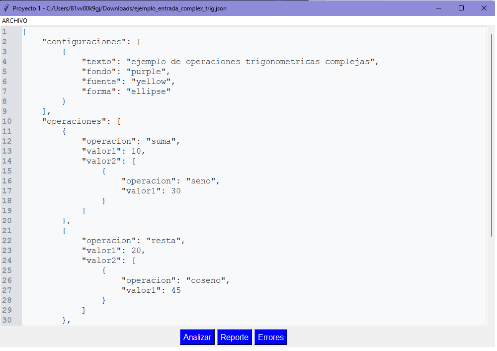
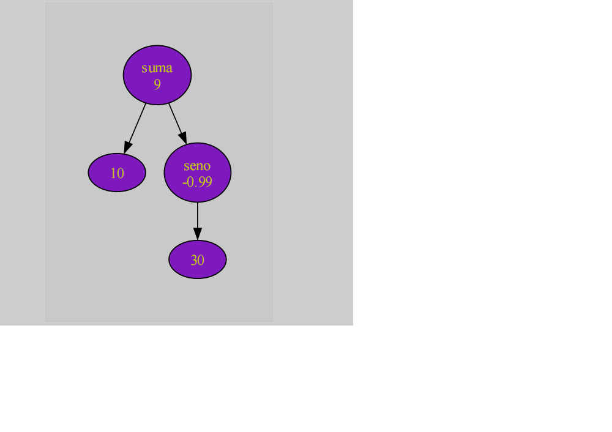
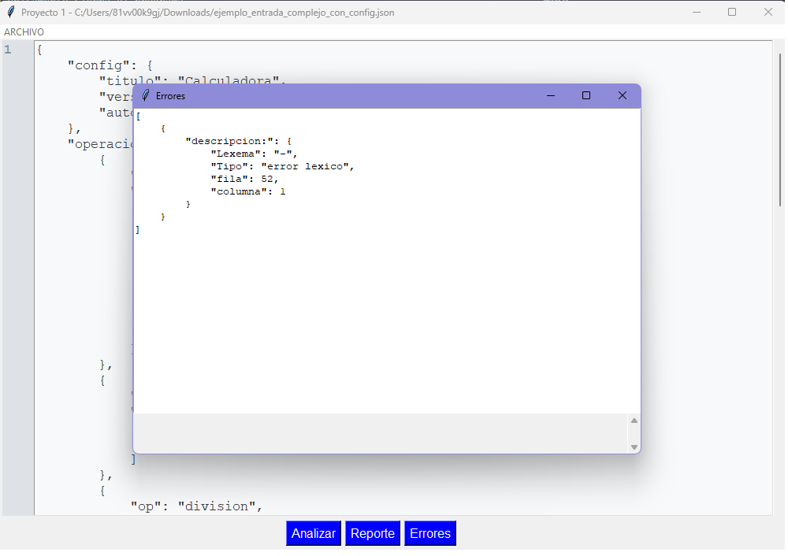

# Manual de usuario 

Lo primero que se ve al ejecutar el programa es la ventana principal.

en la parte superior izquierda cuenta con un menú 
que contiene las opciones:

- Guardar
- Abrir
- Guardar como
- Salir

**Guardar**

Esta opción nos permite guardar el archivo que se nos está mostrando en pantalla con un nombre preestablecido el cual es: archivo_entrada.json

**Guardar como**

Esta opción nos permite guardarl el archivo con el nombre que nosotros queramos, la diferencia entre esta opción y la enterior es que en esta opción no se nos recomienda por default ningún nombre.

**Salir**

Esta opción únicamente cierra el programa.

**Abrir**

Para usar el programa primero tenemos que presionar esta opción para que nos permita selecionar un archivo para que el programa lo analice.

Observamos que aparece el archivo json que hemos seleccionado en la ventana, este documento se puede modificar como uno quiera.

Además tenemos los botones:

- Analizar
- Reporte
- Errores

**Analizar**

 Analizará el texto que se muestra en pantalla y mostrará los elementos reconocidos.

**Reporte**

 Se generarán los diagramas de las operaciones previamente analizadas
 

 **Errores**
 Se muestran los errores en el documento con formato json
  

